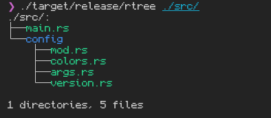

# rtree

A Directory listing program written in Rust, inspired by the Unix `tree` command.

## Description

`rtree` is a command-line tool that displays the directory structure of a specified path in a tree-like format. it offers various options for customizing the output, such as showing hidden files, displaying only directories, and coloring the output.

## Demo
Here is a demo of `rtree` in action:



## Prerequisites

For Linux and macOS:
To run this program, you will need to have the following software installed on your system:
- Rust programming language (https://rust-lang.org/tools/install/), which includes Cargo, the Rust package manager.

For Windows:
Note: Windows support is not planned for the initial release, but may be added in the future.

## Installation


Currently, the project is in development, installation instructions will be provided here once the project is ready for distribution.

To run it in its current state, you can clone the repository and build it using Cargo:

```bash
git clone https://github.com/Jeav2/rtree.git
cd rtree
cargo build --release
```
After building, you can run the program using:

```bash
./target/release/rtree [starting_directory] [options]
``` 

## Usage

`rtree [OPTIONS] [PATH]`

### Arguments

- `PATH`: The starting directory to display. If not provided, it defaults to the current working directory.

### Options
| Short option | Long option     | Description                          |
|--------------|-----------------|--------------------------------------|
| `-s`         | `--show-hidden` | Include hidden files and directories |
| `-o`         | `--only-dirs`   | Show only directories                |
| `-d`         | `--dir-color`   | Set directory color                  |
| `-f`         | `--file-color`  | Set file color                       |
| `-h`         | `--help`        | Print help                           |
| `-V`         | `--version`     | Print version                        |

#### Colors

Colors can be specified using named colors.
All available colors are listed in the [colors module](src/config/colors.rs) and include: `black`, `red`, `green`, `yellow`, `blue`, `magenta`, `cyan`, `white`.

## Features

note: This is for a school project, so I am planing on implementing the "Must have" and "Should have" features, when the project is handed in and the "Could have" features are not implemented yet I will add those in my own time.

| Must have                                                                      | Should have                                              | Could have                                                                                        | Won't have                                                    |
|--------------------------------------------------------------------------------|----------------------------------------------------------|---------------------------------------------------------------------------------------------------|---------------------------------------------------------------|
| The program displays a tree-like structure of directories and files (in color) | Clickable terminal links to open directories and files   | Commandline argument for specifying the file explorer to use when opening links                   | Windows support (initial release will be Linux and macOS only)|
| Command-line argument for turning color on/off                                 | Command-line argument for turning links on/off           | Command-line argument for exporting the directory structure to a file (e.g., JSON, XML, TXT, etc) |                                                               |
| Command-line argument for only displaying directories                          | Configuration file support (toml file)                   |                                                                                                   |                                                               |
| Command-line argument for specifying starting directory                        |                                                          |                                                                                                   |                                                               |
| Command-line argument for displaying hidden files                              |                                                          |                                                                                                   |                                                               |

## Contributing

Contributions are welcome, especially small fixes and documentation improvements.

- Keep pull requests focused and easy to review.
- Include a short summary of what changed and why.
- Add example output when changing CLI behavior.
- Run: `cargo fmt`, `cargo clippy -- -D warnings`, and `cargo test`.

By contributing, you agree your contributions are licensed under Apache-2.0.

## License

This project is licensed under the Apache License, Version 2.0. See the [LICENSE](LICENSE) file for details. 
See the [NOTICE](NOTICE) file for additional attribution and notices.

## Attribution

This project includes code originally created by Jeav2 (https://github.com/Jeav2/rtree).

When redistributing this project (including modified versions or binaries), you must include the following attribution in your project's README:

"Contains code originally by Jeav2 (https://github.com/Jeav2/rtree) licensed under Apache-2.0."

## Reuse checklist

- Keep the Apache-2.0 `LICENSE` text with your redistribution.
- Preserve the `NOTICE` content in your distribution materials.
- Add the required attribution line to your project's README.
